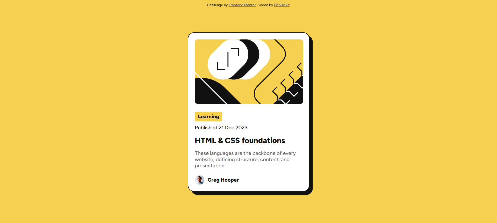

# Frontend Mentor - Blog preview card solution

This is a solution to the [Blog preview card challenge on Frontend Mentor](https://www.frontendmentor.io/challenges/blog-preview-card-ckPaj01IcS). Frontend Mentor challenges help you improve your coding skills by building realistic projects. 

## Table of contents

- [Overview](#overview)
  - [The challenge](#the-challenge)
  - [Screenshot](#screenshot)
  - [Links](#links)
- [My process](#my-process)
  - [Built with](#built-with)
  - [What I learned](#what-i-learned)
  - [Continued development](#continued-development)
  - [Useful resources](#useful-resources)
- [Author](#author)
- [Acknowledgments](#acknowledgments)

## Overview

Just a quick challenge I decided to do in my free time

### The challenge

Users should be able to:

- See hover and focus states for all interactive elements on the page

### Screenshot

### Links

- Solution URL: [Add solution URL here](https://github.com/FichBickit/blog-preview-card-main)
- Live Site URL: [Add live site URL here](https://fichbickit.github.io/blog-preview-card-main/)

## My process

Another quick speedrun project that I did for fun, and this one was more fun as well, with a few satisfying interactives

### Built with

- HTML
- CSS

### What I learned

This was the most satisfying thing that I did in the project:

.header {
    margin-bottom: 15px;
    font-family: "aNiceBoldFont", sans-serif;
    transition: 0.3s;
}
.header:hover {
    color: var(--yellow);
    cursor: pointer;
}

The hover states were very satisfying and I enjoyed them

### Useful resources

- [W3Schools](https://www.w3schools.com/cssref/css3_pr_box-shadow.php) - W3Schools is always a great website for tips on projects, and this one was no exception> It helped me to know how to use box-shadow to get the nice border shadow effect

## Author

- Frontend Mentor - [@fichbickit](https://www.frontendmentor.io/profile/fichbickit)
- GitHub - [@fichbickit](https://github.com/FichBickit)
